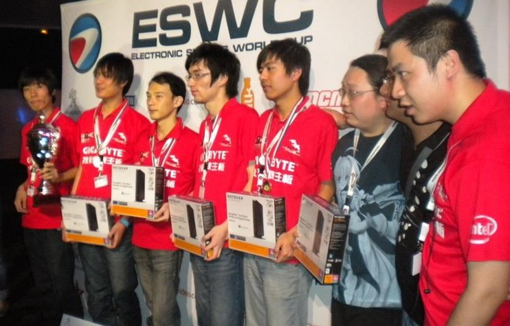

##           长剑倚天平步青云 传奇队长820和DOTA的不解之缘

​        820，一个曾为俱乐部，为中国DOTA夺得无数荣誉的战队领袖，一个心高气傲的Carry选手，一个获得冰蛙冠名的辅助，外战英雄，指挥大师，大满贯选手，一块中国DOTA职业历史的活化石。566，OB里面的酱油角色，一个非一线DOTA2解说，一个淘宝店都开不下去的主播，一个官方活动也很难看到的边缘角色。提起现在的566，恐怕接触DOTA时间不长的人，很难将这个天梯分数并不高的解说和那个传奇队长820画上等号。也看过很多人发出质疑，为什么曾经的传奇队长退役后的生活却如此平淡，人气和曾经的荣誉不成正比。有人说因为性格，有人说因为不会经营，有人说因为说话呜噜噜，编者也搞不明白这个问题，或许820本人也不想搞明白。从爱好到职业，从Carry到辅助，从幕后工作到前台解说，从老鼠820组合到OB，一晃十余年。820始终没有离开DOTA，是真爱，也是生活。

### **1 职业先驱**

​       820从小就表现出对游戏的浓厚兴趣，从小学开始，他开始接触各种游戏。从红白机，到街机，再到电脑游戏，流行过的游戏，他几乎都接触过。06年上半年，汉化版DOTA的出现，让他开始和这款游戏结下了不解之缘。

​       "我玩过很短时间的魔兽对战，后来就觉得没什么意思了。大概05年上高中就开始玩魔兽RPG，各种RPG换着玩，什么有趣就玩什么。那时候国内DotA其实也才刚刚出来，但汉化没做好。于是大家刚开始玩的是真三，差不多在06年上半年，DotA汉化的比较完美了，渐渐地开始流行。我也差不多在这个时候开始玩了。"  

​       虽然当时War3在国内热度很高，但DOTA对大多数玩家来说，还是新鲜事物。当时正是820等一批老玩家建立了最早的DOTA职业圈子。06年，VS平台刚刚建立，没有DOTA专房；浩方只有一个200人的房间，长期人都不满。当时DOTA的汉化也不是很完美，有较多的错误和没有翻译到的地方，820一边猜，一边试，慢慢对这个游戏了解深刻起来。对DOTA越了解，越喜欢这个游戏。

​        2017年，如果有人说他要投身电竞，并且有不错的实力，也许会得到家人和很多人的支持。但在07年，17岁的邹倚天就有了投身职业的想法，在当时来看，是非常让人难以理解的。这个阶段的DOTA职业圈，还是一个鲜为人知的圈子，820也没有可以学习的偶像，就这样，820作为一个先驱者，开始了自己的DOTA职业生涯。

​        "其实当时家人已经在联系上海广电电子学校了，要去学焊工。当时DotA渐渐地热了起来，我打的也不错。那时候还有一种想法，觉得文凭没什么用。经过仔细权衡，我选择了职业电竞。"

​        "我当时个人觉得，只要不再管他们要钱，能够自己养活自己，走出一条路来，就没有什么好妥协的。后来拿了奖金，父母也开始明白，三百六十行，行行出状元嘛。"

### **2 倚天既出，谁与争锋** 

​        刚刚有意职业的820加入了U9论坛水友小熊组建的GL战队，这应该是中国DOTA最早的职业战队。在GL这段时间，820训练很刻苦，成长速度也很快，对于不满二十岁的少年来说，似乎有用不完的精力，820也展现出了自己不同寻常的天赋，很快，他在比赛中崭露头角，有了一定的名气和地位。

 萧瑟秋风江湖远，倚天万里须长剑。

​       随着队伍和个人实力的提升，820很快展露了自己的锋芒。07年5月，820所在的GL"月之队"夺得WCG中国区总决赛冠军，获得了代表中国出征ACG锦标赛的机会。随后的7月，GL一路过关斩将，击败东南亚各个强队，将最后的冠军收入囊中，这也是中国DOTA战队在亚洲DOTA赛事获得的第一个冠军。

​        虽然当时的冠军只有4W块，五个队员平均一下也就8000，和现在的赛事不能做对比，但对于当时的820来说，已经弥补了生活上的很多困难，可以安心训练一段时间。同时这份荣誉，也坚定了820职业之路的决心。可惜好景不长，因为当时电竞行业刚刚起步，再加上很多俱乐部不看好DOTA的前景，GL迟迟找不到赞助商，虽然WE和他们接触过，但最后也不了了之，GL无奈解散。离开GL的820在上海组建了一支本土战队Cant，当时的队友就有后来被大家所熟知的357。这时候的国内DOTA职业圈，也只有Ehome能和Cant一较高下，这段时间的820，对DOTA的理解也越来越深。

​        "我在Cant算是挑大梁，带节奏，压力很大，但对自己的提高也很快。那时候我的位置也很飘忽，123号位都打过，基本上是队伍需要什么位置我就得去补上。"

​        尽管Cant表现优异，但在08年WCG中国区DOTA总决赛中，他们还是输给了当时拥有09，LongDD，Snoy，DC全明星阵容的Ehome，同时也失去了参加ACG亚锦赛的门票。随后在ACG上，Ehome全胜夺冠，本次比赛后，09和LongDD因为个人原因离队，71再次找到820，这次他和357一起，加盟Ehome，和DC，Snoy成为了队友。

​        值得一提的是，在820离开Cant之后，一个崭露头角的年轻人加盟了Cant，他的ID叫"Burning"。加盟Ehome之后，820的表现也没有让71失望，夺得SMM国际邀请赛冠军，掌门人邀请赛冠军，WGT大师赛冠军，在队长DC的带领下，Ehome在2008年迎来了自己的第一个王朝。820也逐渐被大家所熟知。

​        09年，元老DC和Snoy退役，820临危受命担任队长，率领还不够熟悉的队友苦苦支撑，成绩惨淡，甚至输给了当时的清华高校战队。不过在当年WCG中国区总决赛中，820用影魔击败周所在的CD战队，30分钟飞鞋分身冰眼，在当时来说，这已经是可怕的刷钱速度，这个时候他便有了"8老板"的外号，因为820总比对方后期多一个大件。

​        10年初，820迎来了已经颇有名气的Burning和Kingj两个队友，当然，820是整个队伍的战术核心和精神领袖，这样的全明星阵容，并没有良好的化学反应。820主动求变，让出了Carry位置，为Ehome的崛起埋下了伏笔。这样的让步现在看来没什么，但那个时期的DOTA，辅助都是非常悲惨的角色，保命道具少，刷钱慢，很难有亮眼的发挥，820的牺牲不仅是为了整个队伍的牺牲，而且是对自己非常大的挑战。

​        "Cant时期，我就注意到Burning了，他那个时候只能算是初出茅庐。但是到了CH之后，他就开始有自己的风格特征了。他的操作很好，补刀特别犀利，非常适合打carry位置。当时队伍里，能够打4、5号位的只有357和我，而357打4号位打的更好，这就只剩下我去打5号位了。"

​        完成位置调整的Ehome，在2010年只能用如日中天来形容，除了WDC之外，Ehome几乎拿到了所有大赛冠军，完成了史无前例的十冠王。在外战当中，也是屡战屡胜，在全世界范围内都极具统治力。年底，820站在WGT的颁奖舞台上，自豪地宣布"这是我们今年的第十个冠军！"

这是820最辉煌的时期，DOTA的江湖上有倚天剑，却没有能够与其争锋的屠龙刀。

### **3 激流勇退**

​      没有永远的王朝，再强大的帝国都不可能一直统治下去。2011元旦，发生了大家耳熟能详的"怀5夜云"，Ehome再次进入动荡期，820的队友换了一批又一批，国土，longDD，老鼠都短暂加盟了Ehome，这个时候的820，便有了退役的念头，三年多的职业生涯，已经让他没有了刚打职业时候的激情。

​      当退役已成定局，国内玩家最关心的，是他们的退役战：第一届在德国科隆举办的DOTA2国际邀请赛。由于国内那时候DOTA1才是主流，大家接触DOTA2都比较晚，而且对100W美金的高额奖金，很多人持怀疑态度，当时的电竞环境不好，很多比赛都出现拖欠，甚至不发奖金的情况。Nv.cn和TYLOO早早地被淘汰出局，iG也没能闯入四强。但让国人欣慰的是，"抗欧英雄"820与他的EH又一次站了出来。逆转M5，大胜MYM，淘汰Scythe.SG，820代表中国站上了决赛的战场。这一次，神话没能继续上演，他们败给Na'Vi，憾失冠军。不过，没有人会觉得他们是失败者。人们谈论更多的，是25万美元亚军奖金，以及820的离开。

​        如果Burning和KingJ还在，他们也许能拿到冠军？

​        "非常有可能，因为我们五个人磨合了很久，默契已经到了一种境界。但现在说这些话已经没有用了，他们获得了4万元的签字费，却失去了争夺100万美元奖金的机会，很让人感慨。这是自己做出的选择，我不确定他们现在是不是感到后悔，但人生是没有后悔药可以吃的。"

​        作为职业选手的820，已经取得了别人可能永远都拿不到的成绩，虽然这时的820只有22岁，但他觉得应该休息了。2011年9月8日，820宣布退役，一代功勋队长就此谢幕。

​        "我出道早，已经打了4年了，锐气消磨的差不多了。你别看打游戏时就坐在那里，其实很累，压力很大。71站在后面看我们比赛都累的不行，何况我们这些场上的队员？人不能打一辈子电竞吧，当主观和客观的条件都有了，退役其实是很自然的选择，之后我可以用一种其他的方式回报电竞。"